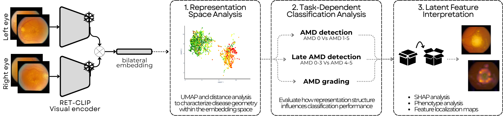

# AMD-Latent
### Exploring the latent structure of AMD severity using retinal foundation models

<picture>
  
</picture>

---

**Retinal foundation models** have demonstrated strong performance across a wide range of ophthalmic tasks, yet relatively little is known about how disease-related information is represented within their learned embeddings and whether this distribution influences downstream prediction performance.

In this work, we use **Age-related Macular Degeneration** (AMD) as a case study to investigate how disease severity is represented within the embedding space of RET-CLIP, a retinal vision-language foundation model, using bilateral fundus images from the AREDS dataset, benchmarked against non-retinal encoders.

The implemented framework contained in this repository analyzes three subsequential tasks:
- Characterizing the distribution of AMD severity within the learned representation space;
- Evaluating latent structure influence across three classification tasks of increasing granularity;
- Analyzing the most influential latent dimensions combining feature attribution, statistical phenotype association, and qualitative image analyses.